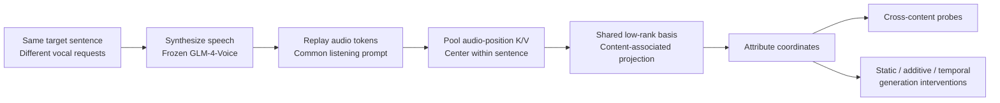

<div align="center">

# ParaGeo
### Decomposing Paralinguistic Variation into a Shared Latent Geometry

**Yuhan Liu · Yuxuan Ou · Ruoxi Su · Mohamed Ahmed Zaki · Yunbo Long**

[Quick start](#quick-start-no-gpu) · [Results](docs/PARAGEO_RESULTS.md) · [Reproduction guide](docs/PARAGEO_REPRODUCIBILITY.md) · [Research history](docs/PARAGEO_HISTORY.md) · [Citation](#citation)

**Frozen speech model · Shared coordinates · Reproducible measurements**

</div>

## Overview

**Do different ways of saying the same words share a reusable internal structure?**

ParaGeo studies this question in GLM-4-Voice. It synthesizes matched-content renditions, replays their audio tokens under a common listening prompt, and extracts pooled key/value representations. Within-sentence centering, low-rank decomposition, and projection against a content-associated reference express requested attributes in a shared coordinate system. The speech-model weights remain frozen.

The repository contains the implementation, experiment configurations, tests, and recorded result summaries. Its historical name, `speech-negotiation-kv`, is retained so existing links and experiment paths keep working. The present focus is **paralinguistic representation analysis**, with separately evaluated generation interventions.



*Method schematic. Replay-time representation measurements and generation-time interventions are separate experiments.*

## Recorded findings

The broad probe crosses **80 requested controls from 12 families** with **eight fixed sentences**. It retains **590 representation records** from 640 requested pairs. This is an author-constructed probe using benchmark-derived request labels, not an official 80-way recognition benchmark.

| Representation | 80-way centroid accuracy | Same-label cross-content cosine |
|---|---:|---:|
| Content-centered full K/V | 11.69% | 0.152 |
| Shared 16-dimensional coordinates | 9.49% | 0.285 |

For the projected representation, the within-content permutation means are **1.247%** and **0.017**, respectively; both conditional tests report **p = 1/1001**. The basis is fitted once on the full calibration pool; label centroids are held out by sentence. These are fixed-basis cross-content measurements, not fold-wise refitting of the projection.

A separate six-style CRAD discovery study reports **85.0% median cross-scenario decoding**, versus 16.7% uniform chance, and reproducible style-contrast directions. The dialogue study motivates the broader probe; its label space and scenarios differ from the 80-control calibration.

**Sources:** [geometry summary](results/parageo_basis_summary.json), [six-style report](results/gate_d_strategy_geometry_report.md). The [results guide](docs/PARAGEO_RESULTS.md) maps each finding to its source and includes all generation comparisons. Current intervention results show attribute- and configuration-specific responses, rather than an established aggregate advantage over norm-matched controls.

## Quick start (no GPU)

Read and inspect the released summaries without downloading a model or invoking a judge:

```bash
git clone https://github.com/yuhanlydia/speech-negotiation-kv.git
cd speech-negotiation-kv
python -m json.tool results/parageo_basis_summary.json
```

Print the primary projected-probe statistics with the Python standard library:

```bash
python - <<'PY'
import json
from pathlib import Path

summary = json.loads(Path("results/parageo_basis_summary.json").read_text())
probe = summary["shuffled_geometry_null"]
print(f"Calibration: {summary['rows']} records, {summary['attributes']} labels")
print(f"Projected accuracy: {100 * probe['real']['loco_accuracy']:.2f}%")
print(f"Cross-content cosine: {probe['real']['cross_content_cosine']:.3f}")
print(f"Conditional p-values: {probe['p_value']}")
PY
```

This inspects saved results; it does not rerun the original experiments. For numerical tests, saved-feature analysis, or new GPU generation, follow the [reproduction guide](docs/PARAGEO_REPRODUCIBILITY.md). Start with its dry-run and artifact checks rather than an unattended full experiment run.

## What is available?

| Resource | Location |
|---|---|
| Geometry construction and diagnostics | [`src/speech_negotiation_kv/parageo.py`](src/speech_negotiation_kv/parageo.py) |
| K/V recording and intervention hooks | [`src/speech_negotiation_kv/kv_hooks.py`](src/speech_negotiation_kv/kv_hooks.py) |
| Main experiment configuration | [`configs/icassp2027_parageo.yaml`](configs/icassp2027_parageo.yaml) |
| Generation, variants, and evaluation | [`scripts/`](scripts/) and [`src/speech_negotiation_kv/`](src/speech_negotiation_kv/) |
| Geometry measurements | [`results/parageo_basis_summary.json`](results/parageo_basis_summary.json) |
| Task results and ablations | [`results/icassp2027/summary.json`](results/icassp2027/summary.json) |
| Balanced 18-label, five-control study | [`results/icassp2027_static_power/summary.json`](results/icassp2027_static_power/summary.json) |
| Tests | [`tests/`](tests/) |
| Historical manuscript drafts | [`paper/`](paper/README.md) |

The reported experiments correspond to snapshot [`b71c6cc`](https://github.com/yuhanlydia/speech-negotiation-kv/tree/b71c6cc5a1faf51f3e95245068b4c9c9241f8c0e). Documentation updates do not constitute new experimental runs. Raw local K/V arrays, generated waveforms, model weights, and complete run-level judge metadata are **not bundled with this public summary release**. See the [artifact and measurement notes](docs/PARAGEO_REPRODUCIBILITY.md#artifact-and-measurement-notes).

## Citation

The author order follows the current manuscript. This entry identifies the research code; it does not assert conference acceptance or an assigned DOI.

```bibtex
@misc{liu2026parageo,
  title        = {ParaGeo: Decomposing Paralinguistic Variation into a Shared Latent Geometry},
  author       = {Liu, Yuhan and Ou, Yuxuan and Su, Ruoxi and Zaki, Mohamed Ahmed and Long, Yunbo},
  year         = {2026},
  howpublished = {Research code and result summaries},
  url          = {https://github.com/yuhanlydia/speech-negotiation-kv}
}
```

Machine-readable author and repository metadata are provided in [`CITATION.cff`](CITATION.cff).

## Questions and reuse

For a reproducibility issue, include the repository commit, command, environment, and relevant item or branch IDs. Do not post API keys, private audio, or credentials in an issue. The repository currently does not include a license grant; contact the authors about reuse permissions. External models and datasets remain subject to their own terms.
